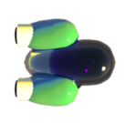
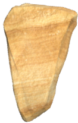
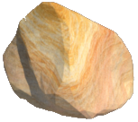
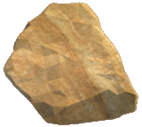
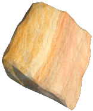

## Introduction

We all dream of making an app that’s wildly popular. It goes viral and gives you enough income to quit your day job. Flappy Bird was an app that managed to get big, and I will give you all the tools to reproduce it.

Flappy Ship is a clone of the wildly popular Flappy Bird. You guide your ship through an asteroid field. Tap to make the ship float up, and avoid touching asteroids. In this quick tutorial we will go over the following topics:

* Drawing graphics

* Moving graphics

* Handling touch input

* Detecting collisions

* Buttons

## Writing the code

Remember to use the kivy documentation at kivy.org.

## Step 1: Load the essential modules you’ll use 


```python
import kivy
kivy.require('1.9.1')
 
from kivy.app import App
from kivy.uix.widget import Widget
from kivy.uix.label import Label
from kivy.uix.button import Button
from kivy.core.window import Window
from kivy.properties import NumericProperty
from kivy.clock import Clock
from kivy.graphics import Rectangle
from random import randint
```

## Step 2: Set desired graphic settings


```python
from kivy.config import Config
Config.set('graphics','resizable',0) #don't make the app re-sizeable
#Graphics fix
 #this fixes drawing issues on some phones
Window.clearcolor = (0,0,0,1.) 
```

## Step 3: Create your classes

The game consists of the ship, asteroids, and the main application. We create a class for each of these, and we create a class to for buttons. Since multiple objects in a game will handle graphics, its useful to have a generic class that sets up widgets in kivy in a way that they can be displayed and moved around the screen. The kivy way of doing things involves using a .kv file, but I prefer to have everything done in python. This means that it’s slightly more difficult to place graphics initially, but I find it much easier to move them around and keep track of things when only dealing with python code.

Because I want to do all of the coding in python and not use the kv scripting language, the following code is extremely important. It took me dozens of hours of googling around to learn how to do this properly. It is the most important snippet of code you’ll find on this blog, and I hope it serves you well.


```python
class WidgetDrawer(Widget):
    #This widget is used to draw all of the objects on the screen
    #it handles the following:
    # widget movement, size, positioning
    #whever a WidgetDrawer object is created, an image string needs to be specified
    #example:    wid - WidgetDrawer('./image.png')
 
    #objects of this class must be initiated with an image string
#;You can use **kwargs to let your functions take an arbitrary number of keyword arguments
#kwargs ; keyword arguments
    def __init__(self, imageStr, **kwargs): 
        super(WidgetDrawer, self).__init__(**kwargs) #this is part of the **kwargs notation
#if you haven't seen with before, here's a link http://effbot.org/zone/python-with-statement.html     
        with self.canvas: 
#setup a default size for the object
            self.size = (Window.width*.002*25,Window.width*.002*25) 
#this line creates a rectangle with the image drawn on top
            self.rect_bg=Rectangle(source=imageStr,pos=self.pos,size = self.size) 
#this line calls the update_graphics_pos function every time the position variable is modified
            self.bind(pos=self.update_graphics_pos) 
            self.x = self.center_x
            self.y = self.center_y
#center the widget 
            self.pos = (self.x,self.y) 
#center the rectangle on the widget
            self.rect_bg.pos = self.pos 
 
    def update_graphics_pos(self, instance, value):
#if the widgets position moves, the rectangle that contains the image is also moved
        self.rect_bg.pos = value  
#use this function to change widget size        
    def setSize(self,width, height): 
        self.size = (width, height)
 #use this function to change widget position    
    def setPos(xpos,ypos):
        self.x = xpos
        self.y = ypos
```

The above class is used to draw the graphics. It also makes the image moveable, and updates the drawing of the image every time the position property is modified. This means that changing the x position of your widget also changes the x position of its image. Every widget with a drawing will inherit this class, to save time and clean up the code.

Our next two classes will use the WidgetDrawer class to facilitate drawing images. They will be the ship and asteroid classes.


```python
class Asteroid(WidgetDrawer):
    #Asteroid class. The flappy ship will dodge these
    velocity_x = NumericProperty(0) #initialize velocity_x and velocity_y
    velocity_y = NumericProperty(0) #declaring variables is not necessary in python
 #update the position using the velocity defined here. every time move is called we change the position by velocity_x  
    def move(self):                    
        self.x = self.x + self.velocity_x 
        self.y = self.y + self.velocity_y 
    def update(self): 
#the update function moves the astreoid. Other things could happen here as well (speed changes for example)       
        self.move() 
```

The next class is for the ship. It looks similar to the asteroid class.


```python
class Ship(WidgetDrawer):
    #Ship class. This is for the main ship object. 
    #velocity of ship on x/y axis
 
    impulse = 3 #this variable will be used to move the ship up
    grav = -0.1 #this variable will be used to pull the ship down
 
    velocity_x = NumericProperty(0) #we wont actually use x movement
    velocity_y = NumericProperty(0) 
 
    def move(self):                    
        self.x = self.x + self.velocity_x 
        self.y = self.y + self.velocity_y 
 
        #don't let the ship go too far
        if self.y  Window.height*0.95: #don't let the ship go up too high
            self.impulse = -3
 
    def determineVelocity(self):
        #move the ship up and down
        #we need to take into account our acceleration
        #also want to look at gravity
        self.grav = self.grav*1.05  #the gravitational velocity should increase
        #set a grav limit
        if self.grav < -4: #set a maximum falling down speed (terminal velocity)
            self.grav = -4
        #the ship has a propety called self.impulse which is updated
        #whenever the player touches, pushing the ship up
        #use this impulse to determine the ship velocity
        #also decrease the magnitude of the impulse each time its used
 
        self.velocity_y = self.impulse + self.grav
        self.impulse = 0.95*self.impulse #make the upward velocity decay
 
    def update(self):
        self.determineVelocity() #first figure out the new velocity
        self.move()              #now move the ship
```

The next class will be used to streamline buttons. For now we will have just one button. More are planned for future versions.


```python
class MyButton(Button):
    #class used to get uniform button styles
    def __init__(self, **kwargs):
        super(MyButton, self).__init__(**kwargs)
 #all we're doing is setting the font size. more can be done later
        self.font_size = Window.width*0.018
```

Next we will create the main widget for the screen. This widget will have the ship and asteroids drawn on top of it.


```python
class GUI(Widget):
    #this is the main widget that contains the game. 
    asteroidList =[] #use this to keep track of asteroids
    minProb = 1700 #this variable used in spawning asteroids
    def __init__(self, **kwargs):
        super(GUI, self).__init__(**kwargs)
        l = Label(text='Flappy Ship') #give the game a title
        l.x = Window.width/2 - l.width/2
        l.y = Window.height*0.8
        self.add_widget(l) #add the label to the screen
 
        #now we create a ship object
 #notice how we specify the ship image
        self.ship = Ship(imageStr = './ship.png')
        self.ship.x = Window.width/4
        self.ship.y = Window.height/2
        self.add_widget(self.ship)
 
    def addAsteroid(self):
        #add an asteroid to the screen 
        #self.asteroid 
        imageNumber = randint(1,4)
        imageStr = './sandstone_'+str(imageNumber)+'.png'     
        tmpAsteroid = Asteroid(imageStr)
        tmpAsteroid.x = Window.width*0.99
 
        #randomize y position
        ypos = randint(1,16)
 
        ypos = ypos*Window.height*.0625
 
        tmpAsteroid.y = ypos
        tmpAsteroid.velocity_y = 0
        vel = 10
        tmpAsteroid.velocity_x = -0.1*vel
 
        self.asteroidList.append(tmpAsteroid)
        self.add_widget(tmpAsteroid)
 
    #handle input events
    #kivy has a great event handler. the on_touch_down function is already recognized 
    #and doesn't need t obe setup. Every time the screen is touched, the on_touch_down function is called
    def on_touch_down(self, touch):
        self.ship.impulse = 3 #give the ship an impulse
        self.ship.grav = -0.1 #reset the gravitational velocity
 
    def gameOver(self): #this function is called when the game ends
        #add a restart button
        restartButton = MyButton(text='Restart')
 
        #restartButton.background_color = (.5,.5,1,.2)
        def restart_button(obj):
        #this function will be called whenever the reset button is pushed
            print 'restart button pushed'
            #reset game
            for k in self.asteroidList:
                self.remove_widget(k)
 
                self.ship.xpos = Window.width*0.25
                self.ship.ypos = Window.height*0.5
                self.minProb = 1700
            self.asteroidList = []
 
            self.parent.remove_widget(restartButton)
 #stop the game clock in case it hasn't already been stopped
            Clock.unschedule(self.update)
 #start the game clock           
            Clock.schedule_interval(self.update, 1.0/60.0) 
        restartButton.size = (Window.width*.3,Window.width*.1)
        restartButton.pos = Window.width*0.5-restartButton.width/2, Window.height*0.5
        #bind the button using the built-in on_release event
        #whenever the button is released, the restart_button function is called       
        restartButton.bind(on_release=restart_button) 
 
        #*** It's important that the parent get the button so you can click on it
        #otherwise you can't click through the main game's canvas
        self.parent.add_widget(restartButton)
 
    def update(self,dt):
                #This update function is the main update function for the game
                #All of the game logic has its origin here 
                #events are setup here as well
        #update game objects
        #update ship
        self.ship.update()
        #update asteroids
        #randomly add an asteroid
        tmpCount = randint(1,1800)
        if tmpCount > self.minProb:            
            self.addAsteroid()
            if self.minProb < 1300:
                self.minProb = 1300
            self.minProb = self.minProb -1
 
        for k in self.asteroidList:
            #check for collision with ship
            if k.collide_widget(self.ship):
                print 'death'
                #game over routine
                self.gameOver()
                Clock.unschedule(self.update)
                #add reset button
            k.update()
```

Now it’s time for the final class, our main application class


```python
class ClientApp(App):
 
    def build(self):
        #this is where the root widget goes
        #should be a canvas
        parent = Widget() #this is an empty holder for buttons, etc
 
        app = GUI()        
        #Start the game clock (runs update function once every (1/60) seconds
        Clock.schedule_interval(app.update, 1.0/60.0) 
        parent.add_widget(app) #use this hierarchy to make it easy to deal w/buttons
        return parent
```

## Part 4: Run the code

This final piece will get everything started when you run the python script


```python
if __name__ == '__main__' :
    ClientApp().run()
```

## Part 5: Put it all together

Go ahead, download the above images, and put all of your code together in a file called main.py. Then run the script!

## Part 6: Recap

The above code shows you all the pieces to put together a simple game like Flappy Ship. We were able to handle drawing and positioning graphics using a great deal of the kivy library. The custom class WidgetDrawer ensures that the graphics get updated when the widget moves.

Touch input is extremely easy to use with kivy. The event handler does the heavy lifting, and the code above inside the GUI class above shows you how to use touch input. Collision detection is also very easy because of how kivy is built. Every widget contains the function “collide_widget()” so testing for collision between objects a and b is as easy as “a.collide_widget(b)”. The button example above shows you how to bind a callback to the on_button_release event.

If you are looking for more information about how kivy works, I recommend reading the following:

Events and Properties

Architectural Overview

## Part 4: Graphic assets






